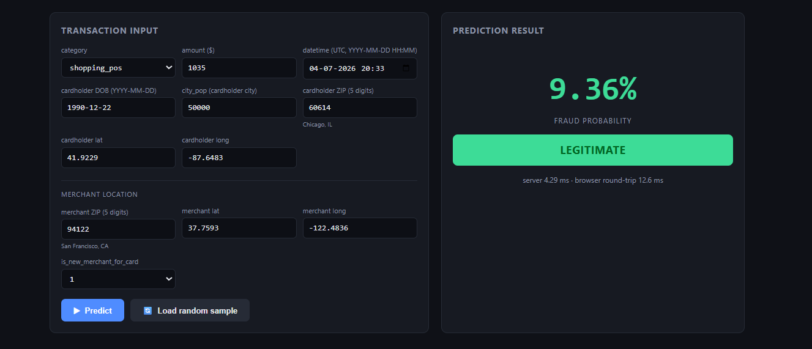
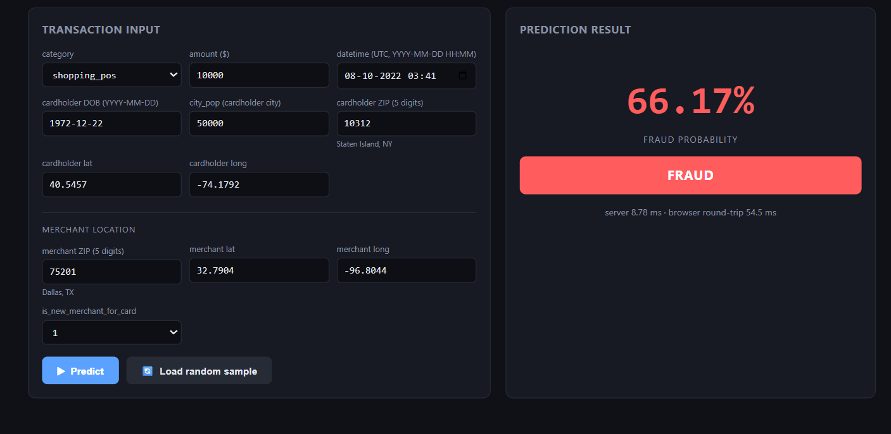
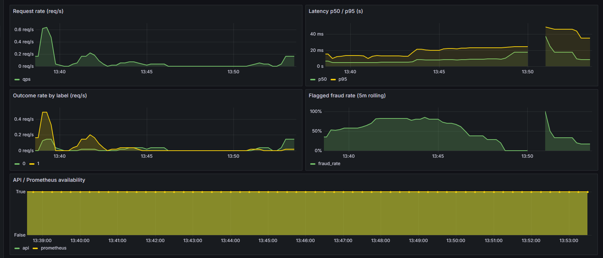
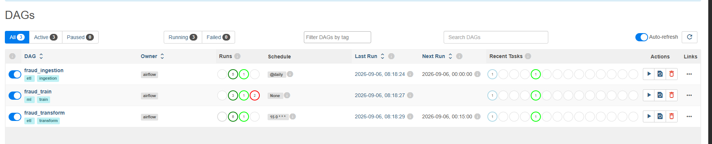
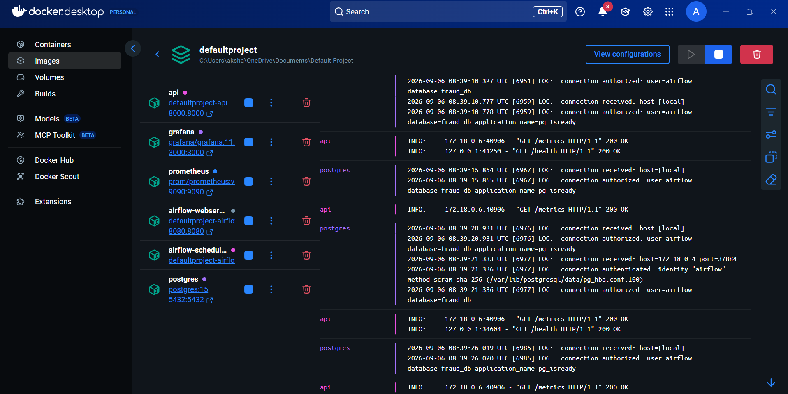

# Fraud Detection ML Pipeline

End-to-end credit-card fraud detection: automated ETL → XGBoost model training → containerized FastAPI serving → live Prometheus/Grafana monitoring — all runnable with one command.

## Features

- **Fully automated pipeline** — Airflow DAGs ingest, validate, transform, and train, each gated by data-quality checks. Trigger train manually; everything else runs on a schedule.
- **Demo console UI** (`http://localhost:8000`) — predict fraud probability on *any* transaction straight from the browser:
  - Load a real gold-table sample (6 known-fraud + 6 known-legit) with a click.
  - Type an amount, category, and datetime — no raw timestamps needed.
  - Auto-fill cardholder/merchant coordinates from a US ZIP code (bundled ~41k-ZIP offline dataset, zero API keys).
- **Production-grade serving** — FastAPI `/predict`, `/health`, offline ZIP geocoding, and Prometheus `/metrics`, scraped into an auto-provisioned **Fraud Monitoring** Grafana dashboard (request rate, latency p50/p95, outcome split, flagged-fraud rate).
- **One-command infrastructure** — `docker compose up -d` brings up Postgres, Airflow, the API, Prometheus, and Grafana.

## Architecture

```
Kaggle API  ->  Airflow DAGs  ->  PostgreSQL  ->  XGBoost training  ->  FastAPI  ->  Prometheus / Grafana
                  (ETL)           (warehouse)   (temporal holdout)    (serving)       (monitoring)

DAG fraud_ingestion:  fetch_data  -> validate_raw               (raw_transactions)
DAG fraud_transform:  transform   -> validate_features          (feature_transactions)
DAG fraud_train:      train_model -> evaluate_model             (xgb_fraud_model.json + metrics)
fraud_api:            FastAPI /predict, /zip, /metrics          (port 8000)
monitoring:           Prometheus scrapes the API (9090) → Grafana dashboard (3000)
```


## Project Structure

```
fraud-detection-pipeline/
├── airflow/
│   ├── dags/           # Airflow DAG definitions
│   └── scripts/        # ETL + training + evaluation Python
├── api/                # FastAPI serving layer
│   ├── data/           # bundled US ZIP → lat/lng dataset (GeoNames)
│   ├── static/         # demo console UI (index.html + gold samples)
│   └── tests/          # parity + endpoint tests (real-row fixtures)
├── sql/                # PostgreSQL schema definitions
├── docker/             # Dockerfiles
├── monitoring/         # Prometheus + Grafana config
├── docs/screenshots/   # README screenshots
├── models/             # trained artifacts (gitignored — regenerate via fraud_train)
└── docker-compose.yml
```


## Airflow DAGs

Three DAGs split the pipeline into independently testable stages:

| DAG | Schedule | Tasks | What it does |
|---|---|---|---|
| `fraud_ingestion` | `@daily` (midnight) | `fetch_data` → `validate_raw` | Downloads the Credit Card Fraud dataset from Kaggle, loads it into PostgreSQL `raw_transactions`, then verifies row/column counts, nulls, and class distribution. |
| `fraud_transform` | daily `00:15` (after ingestion) | `transform` → `validate_features` | Builds the gold `feature_transactions` table (8 ML-ready features) from `raw_transactions` and gates on feature-quality checks + class-imbalance report. |
| `fraud_train` | on-demand (no schedule) | `train_model` → `evaluate_model` | Trains the fraud model on past transactions, then scores it against later transactions it has never seen to measure how well it generalises. Manual-only because the dataset never changes, so there is no value in re-running it on a schedule. |

## Docker Containers

| Container | Role | Exposed port |
|---|---|---|
| `fraud_postgres` | The database that stores all transaction data (plus Airflow's own bookkeeping). | 5432 |
| `fraud_airflow_webserver` | The Airflow dashboard you open in your browser to see, trigger, and check on the DAGs. | 8080 |
| `fraud_airflow_scheduler` | The background worker that actually runs the DAGs on schedule. | — |
| `fraud_api` | FastAPI service — serves the ML model (`/predict`), ZIP lookup (`/zip/{code}`), `/health`, and Prometheus `/metrics`. | 8000 |
| `fraud_prometheus` | Collects and stores API usage/performance numbers so they can be charted. | 9090 |
| `fraud_grafana` | The dashboards page showing live, visual monitoring of the pipeline. | 3000 |
| `fraud_api_tests` | A one-off container used only to run the automated tests on the API. | — |

## Quick Start

```bash
cp .env.example .env        # add your Kaggle API token
docker compose up -d        # starts all services
docker compose up -d --build api   # (rebuild after code changes)
```

| Service | URL | Credentials |
|---|---|---|
| Demo console / API | http://localhost:8000 | — |
| Airflow | http://localhost:8080 | admin / admin |
| Prometheus | http://localhost:9090 | — |
| Grafana | http://localhost:3000 | admin / admin |

## Tech Stack

- **Orchestration:** Apache Airflow 2.10 (LocalExecutor)
- **Database:** PostgreSQL 15
- **ML:** XGBoost, scikit-learn, pandas
- **Serving:** FastAPI + uvicorn
- **Monitoring:** Prometheus + PromClient, Grafana
- **Infra:** Docker Compose

## API

| Endpoint | Purpose |
|---|---|
| `POST /predict` | Score one raw transaction → `{fraud_probability, prediction, latency_ms}`. Body: `time`, `amount`, `category`, `dob`, `city_pop`, cardholder `lat`/`long`, `merch_lat`/`merch_long`, optional `is_new_merchant_for_card`. Unknown fields are rejected (422) instead of silently ignored. |
| `GET /zip/{code}` | Offline US ZIP lookup → `{zip, place, state, lat, lng}` (bundled GeoNames data, ~41k ZIPs) — powers the UI's coordinate auto-fill. |
| `GET /health` | Liveness + model fingerprint (artifact mtime/size, loaded-at). |
| `GET /metrics` | Prometheus text format: request count, latency histogram, outcome counter. |

Example:

```bash
curl -X POST http://localhost:8000/predict -H "Content-Type: application/json" -d @tx.json
```

## Model & Performance

XGBoost trained on the dataset's own **chronological split** (not random): trained on the earlier `source_split='train'` subset, evaluated on the later 'test' subset the model never saw. `scale_pos_weight` derived from the train split only; category target-encoding + imputation values are fit on train and persisted so serve can never drift from training.

Latest temporal-holdout results: **ROC-AUC 0.998, recall 0.947 (2,031/2,145 frauds caught), F1 0.431.**

## Feature Engineering

The gold `feature_transactions` table carries the eight features the model trains on:

| Feature | Definition | Purpose |
|---|---|---|
| `hour_of_day` | UTC hour of the transaction | fraud clusters at certain hours |
| `is_weekend` | 1 on Sat/Sun | weekend activity signal |
| `amount_log` | `ln(amt + 1)` | spreads out tiny fraud amounts |
| `age` | whole calendar years as of tx (from DOB); `>110` nulled → imputed | demography signal |
| `distance_km` | great-circle distance card-pos → merchant-pos | impossible-travel fraud |
| `city_pop_bin` | 0..3 buckets of cardholder `city_pop` | small-city concentration |
| `is_new_merchant_for_card` | 1 if first time this card uses this merchant | card-testing pattern |
| `category_target` | train-only smoothed target encoding | per-category fraud rates |

## Screenshots


### Demo console UI 





### Prometheus Monitoring dashboard



### Airflow DAGs 



### Running containers



## Testing

`api/tests/test_predict.py` runs 16 checks against real-row fixtures carrying gold feature values — encoder parity, artifact parity, endpoint behavior, validation, and ZIP lookup — with no database needed. Run them in a throwaway container:

```bash
docker compose --profile test run --rm api-tests
```

## Dataset

[Credit Card Transactions Fraud Detection](https://www.kaggle.com/datasets/kartik2112/fraud-detection) — 1,852,394 transactions (2012–2013), 9,651 fraudulent (~0.52%). `source_split` marks the chronological train/test boundary the model respects.

## License

MIT
